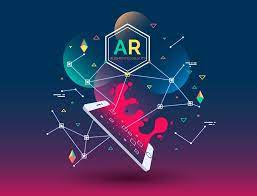

<!-- PROJECT SHIELDS -->
<!--
*** I'm using markdown "reference style" links for readability.
*** Reference links are enclosed in brackets [ ] instead of parentheses ( ).
*** See the bottom of this document for the declaration of the reference variables
*** for contributors-url, forks-url, etc. This is an optional, concise syntax you may use.
*** https://www.markdownguide.org/basic-syntax/#reference-style-links
-->

<!-- PROJECT LOGO -->
 

    
  </a>

  <h3 align="center">ENAME GAME</h3>

  

    AR game made with Unity and LightShip technology
     
    <a href="https://video"><strong>Video Demonstration</strong></a>
  

 

### About The Project

  This
 
 

### Built With

The frameworks/libraries used in this project.

* [Unity](https://unity.com/fr)
* [LightShip ARDK](https://lightship.dev/)
 

### Getting Started

* Use project on PC : you can open it with Unity, the location and VPS system wil not block the game execution in play mode.

* Use the game on Phone : you can use the apk in the builds folder, but you need to be in Audenarde (Belgium) because the game need the right location and VPS scans.
 
 

### Contact
Thank you for your attention.
Hakim Duparcq - hakim.duparcq@student.junia.com
Nicolas Debeurme - nicolas.debeurme@student.junia.com
 